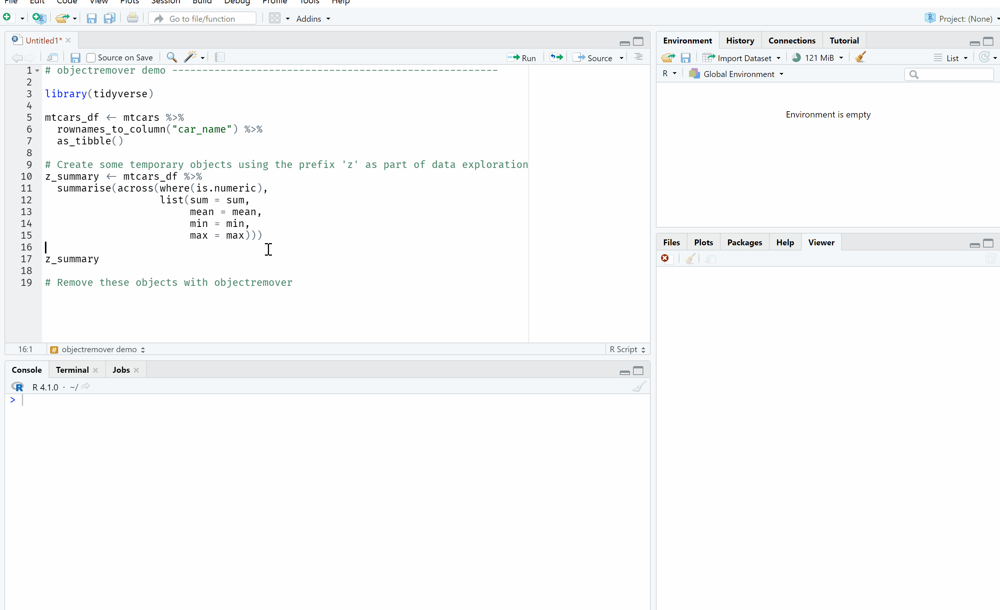

<!-- README.md is generated from README.Rmd. Please edit that file -->

# objectremover 

<!-- badges: start -->

[](https://cran.r-project.org/web/checks/check_results_objectremover.html)
[](https://cran.r-project.org/package=objectremover)
[](https://github.com/alan-y/objectremover/actions)
<!-- badges: end -->

`objectremover` is an RStudio addin to assist with clearing objects from the Global environment. Features include removing objects by

-   Starting pattern of object name
-   Ending pattern of object name
-   Regular expression
-   Object type (dataframe, function and other)

The addin allows the user to quickly tidy up the R workspace which is useful, e.g. when you have stored lots of large, temporary objects in
memory which can often happen during the course of exploratory data analysis. `objectremover` displays exactly which objects will be removed according to the options the user has specified in real time. This feature helps to ensure that you do not remove certain objects by mistake.

## Installation

Install `objectremover` from CRAN with

``` r
install.packages("objectremover")
```

Alternatively, you can install the development version of
`objectremover` with

``` r
remotes::install_github("alan-y/objectremover", ref = "main")
```

## Use

After installing the package, the add-in will be available in RStudio from the **Addins** dropdown menu. Select “Remove Objects” (under the
heading OBJECTREMOVER) from the menu to run.  

If, for example, you have created some temporary objects named using the prefix ‘z’, objectremover can be used to quickly remove all objects
starting with ‘z’ from the Global environment.


